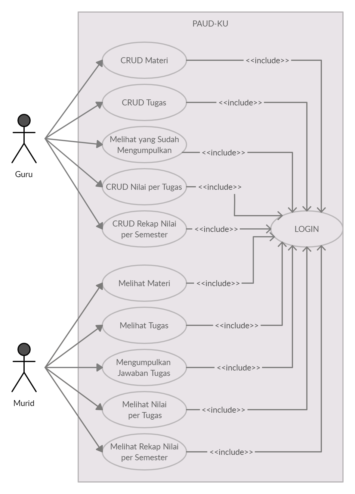
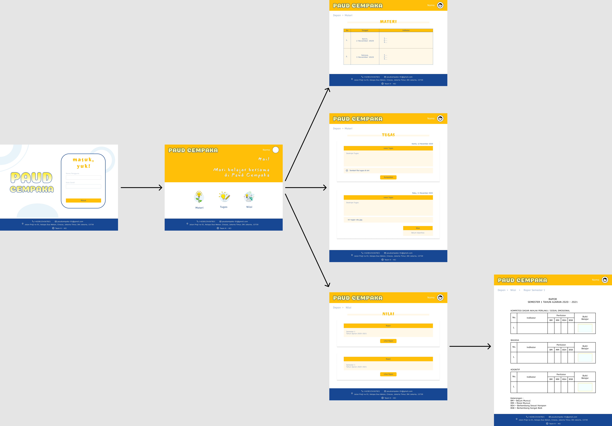

<h1> ASSIGNMENT 3 HUMAN COMPUTER INTERACTION </h1>
<h2>TEAM J</h2>
<ul>
  <li>Savitri (1313619015)</li>
  <li>Dewi Sugianti (1313619010)</li>
  <li>Rahma Wati Malawat (1313619042)</li>
 </ul>
  
  <h2>1st Phase Requirement Gathering</h2>
 PAUD-KU merupakan sistem informasi berbasis web yang dibuat untuk para guru dan murid yang terlibat pada proses pembelajaran jarak jauh di PAUD CEMPAKA. Untuk itu, kami melakukan interview dan obeservasi kepada para guru yang bersangkutan untuk mengumpulkan data mengenai kebutuhan sistem informasi ini. Hasil dari interview dan observasi tersebut telah kami buatkan rekapitulasinya dalam bentuk mini report. 
<ul><li><a href="https://github.com/dewsgnt/PAUD-KU/blob/main/mini_report(phase1)/mini_report1.pdf">Klik di sini untuk melihat mini report</a></li>
<li><a href="https://www.youtube.com/watch?v=sjR5rosupzU&feature=youtu.be">Klik di sini untuk melihat rekaman dari 1st phase requirement gathering.</a></li></ul>

  <h2>Portofolio</h2>
Pembuatan sistem akademik PAUD-KU ini dimaksudkan untuk dapat membantu para guru maupun murid yang tergabung dalam PAUD CEMPAKA. Berdasarkan beberapa masalah yang kami dapatkan setelah melalui proses interview dan observasi, kami menyimpulkan bahwa ada beberapa fitur yang para guru paud butuhkan untuk memudahkannya dalam proses pembelajaran jarak jauh. 
<b>Fitur Guru</b>
<ul>
  <li>Login dengan username dan password yang sudah terdaftar di sistem</li>
  <li>Membuat, melihat, mengedit, dan menghapus materi </li>
  <li>Membuat, melihat, mengedit, dan menghapus tugas juga melihat murid yang sudah mengumpulkan tugas </li>
  <li>Membuat, melihat, mengedit, dan menghapus nilai dari tugas yang sudah dikumpulkan</li>
  <li>Membuat, melihat, mengedit, dan menghapus rekap penilaian per semester </li>
</ul>

<b>Fitur Murid</b>
<ul>
  <li>Login dengan username dan password yang sudah terdaftar di sistem </li>
  <li>Melihat materi </li>
  <li>Melihat tugas dan mengumpulkan jawaban tugas</li>
  <li>Melihat nilai per tugas harian</li>
  <li>Melihat rekap penilaian per semester</li>
</ul>

<h2>Design</h2>
<b> Use Case</b> 

 <b> Interaction Control Guru</b> 

 <b> Interaction Control Murid</b> 

 <b> Mockup Design Murid</b> 
       <ul><li><a href = "https://github.com/dewsgnt/PAUD-KU/tree/main/mockup_design_murid">Lihat di sini </a></li></ul> 
<b> Mockup Design Guru</b> 
       <ul><li><a href="https://github.com/dewsgnt/PAUD-KU/tree/main/mockup_design_guru">Lihat di sini </a></li></ul>

<h2>2nd Phase Requirement Gathering</h2>

Setelah kami selesai membuat desain dari hasil interview dan observasi, kami mengadakan pertemuan lagi dengan para guru di PAUD Cempaka untuk mempresentasikan desain kami. Dan mengonfirmasi lagi bahwa apakah desain yang kami buat sudah sesuai atau belum dengan hasil dari pertemuan kita sebelumnya.

<ul><li><a href="https://www.youtube.com/watch?v=3hSrNOrXVJo&feature=youtu.be">Klik di sini untuk melihat rekaman dari 2nd phase requirement gathering.</a></li></ul>

<h2>Report Writing</h2>

Setelah kami menyelesaikan empat tahapan sebelumnya, kami membuat sebuah final report yang ditulis sebagai rangkuman dari semua tahapan di atas.

<ul><li><a href="https://github.com/dewsgnt/PAUD-KU/blob/main/report_writing/final_report.pdf">Klik di sini untuk melihat Final Report</a></li></ul>

    
    
    
    
    
    
    
    
    
    
    
    
    
    
    
    
    
  
 
